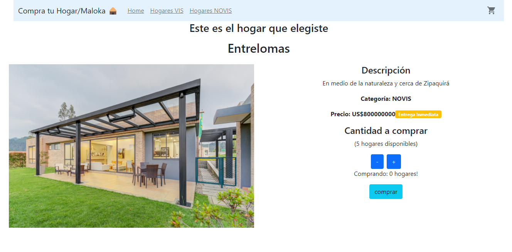

# Compra-Tu-Hogar/Maloka

Es una aplicación web, creada en React enfocada en dispositivos de escritorio. Es un e-commerce que le permite a un potencial comprador, ver, seleccionar, agregar al carrito y generar una orden de compra de un hogar, ya sea casa o apartamento.
Este proyecto fue creado con [Create React App](https://github.com/facebook/create-react-app) y se conecta con una base de datos de Firebase.

## Screenshots del proyecto

## Instrucciones de instalación y configuración

Para empezar, se necesitará `node` y` npm` instalados globalmente en su máquina.
node: https://nodejs.org/es/download/
npm:https://www.npmjs.com/package/download

Es obligatorio ejecutar esta instrucción la primera vez:

`npm install`

Para ejecutar Test Suite:

`npm test`

Para iniciar el servidor:

`npm start`

Para visitar la aplicación:

`localhost:3000/`

## Librerías utilizadas

### Bootstrap

Se utilizó vía CDN, con el objetivo de fácilmente dar estilos a cada vista de la aplicación y hacerla visualmente atractiva, sin perder el foco en la funcionalidad de la app. BS se utiliza para centrar los elementos, para generar los botones, el NavBar, el formulario de orden de compra y la tabla del carrito que muestra los hogares agregados

### Semantic-ui

Se utilizó vía npm, con el objetivo de utilizar algunos componentes predefinidos como iconos

### Material-ui

Se utilizó por su atractivo estético, para las tarjetas de los hogares, para el badge del carrito y algunas alertas como cuando se pasa el stock de un apto

### Firebase

Utilizado para leer/escribir datos de forma persistente y sin necesidad de crear un backend

### Sweetalert2

Usado para generar alertas visualmente atractivas en menos de 1 minuto

### React Router Dom

Usado para crear todas las rutas de la aplicación y sus respectivos componentes Link y NavLink

### Context

Un manejador de estados. Usado principalmente para tener todas las operaciones lógicas del carrito de compras y para guardar todos los hogares agregados a ese mismo carrito

## Dependencias

"@emotion/react": "^11.7.1",
"@emotion/styled": "^11.6.0",
"@material-ui/icons": "^4.11.2",
"@mui/icons-material": "^5.2.5",
"@mui/material": "^5.2.6",
"@testing-library/jest-dom": "^5.16.1",
"@testing-library/react": "^12.1.2",
"@testing-library/user-event": "^13.5.0",
"firebase": "^9.6.1",
"react": "^17.0.2",
"react-dom": "^17.0.2",
"react-router-dom": "^6.2.1",
"react-scripts": "5.0.0",
"semantic-ui-css": "^2.4.1",
"semantic-ui-react": "^2.0.4",
"sweetalert2": "^11.3.0",
"web-vitals": "^2.1.2"

## Objetivo

Una persona pueda ver catálogo de hogares, con sus características, fitrar por categorías, agregarlos al carrito y generar una orden de compra
